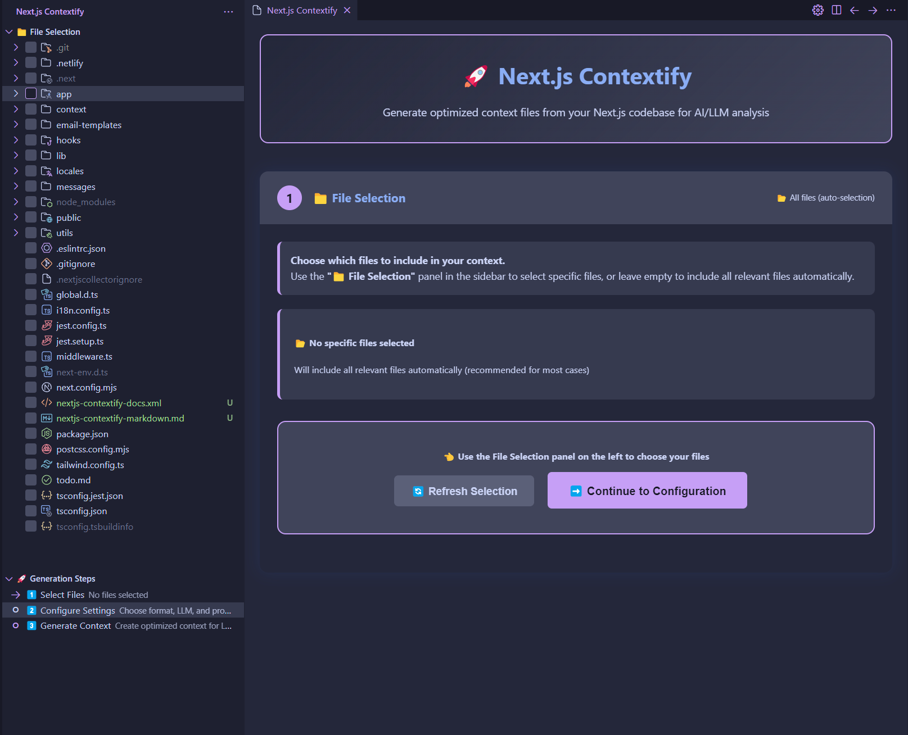
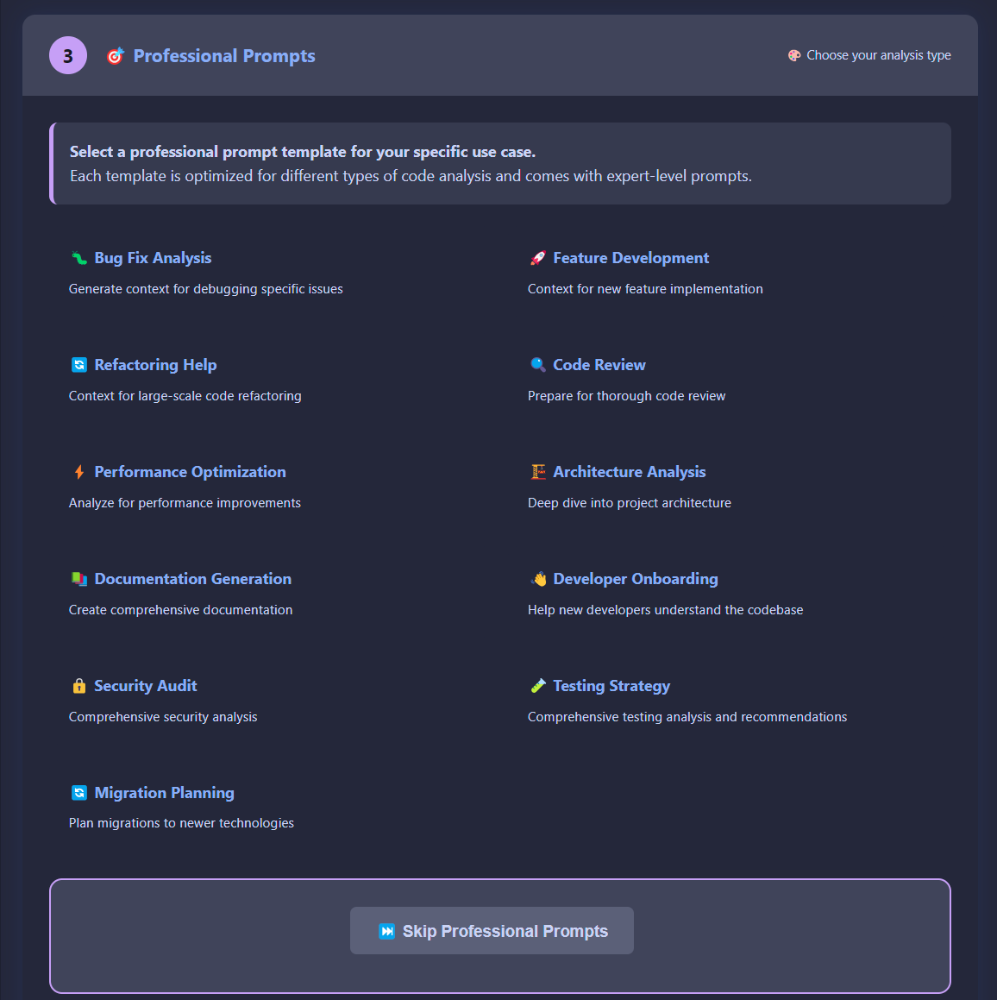
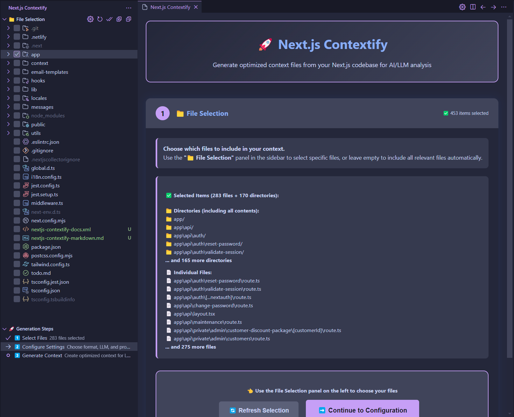
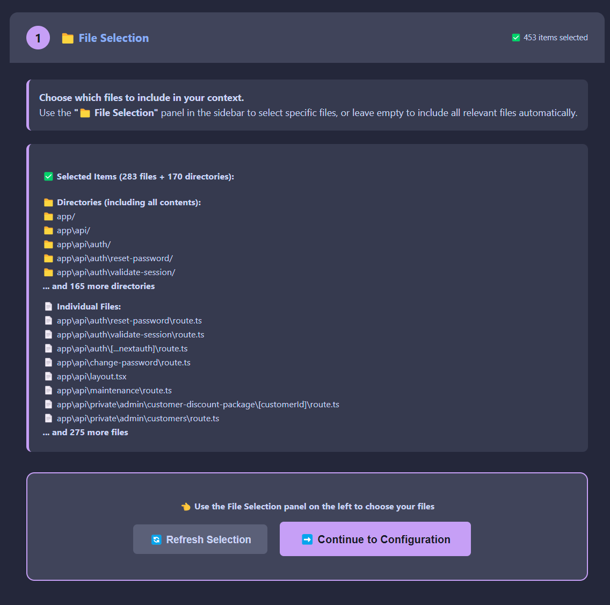
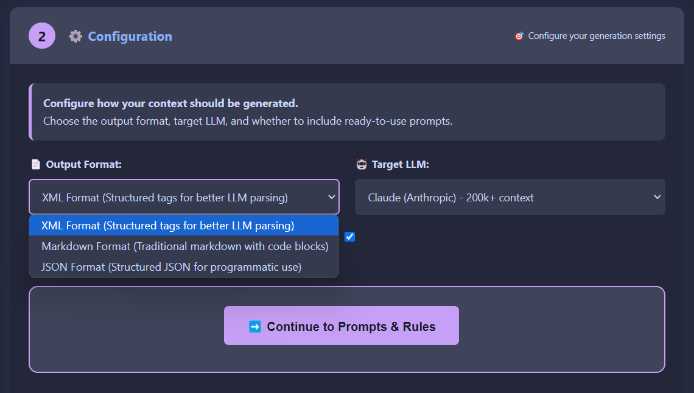
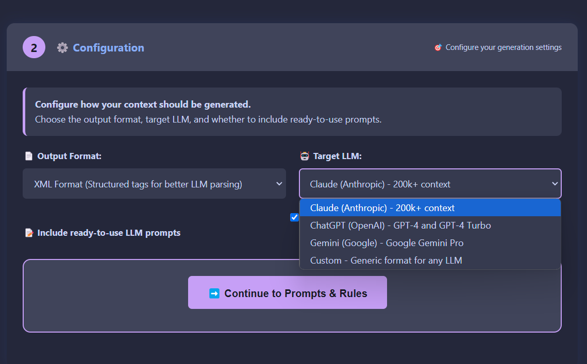
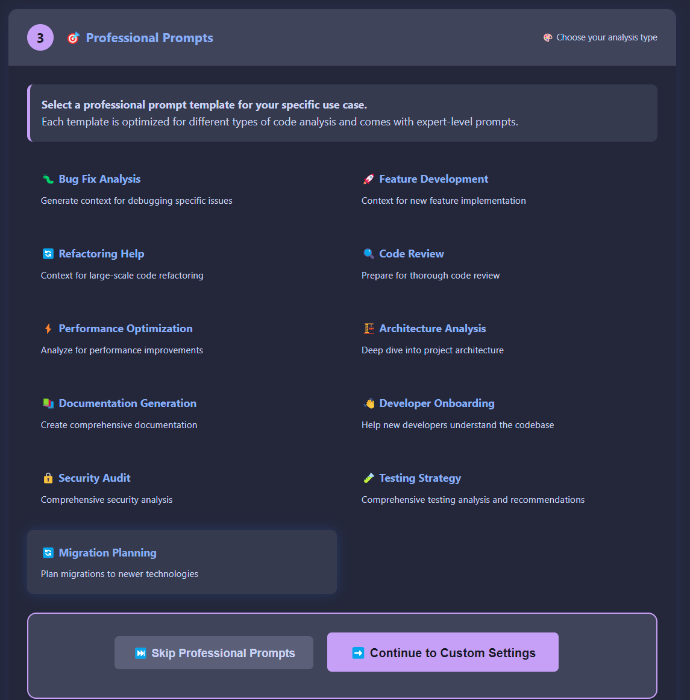
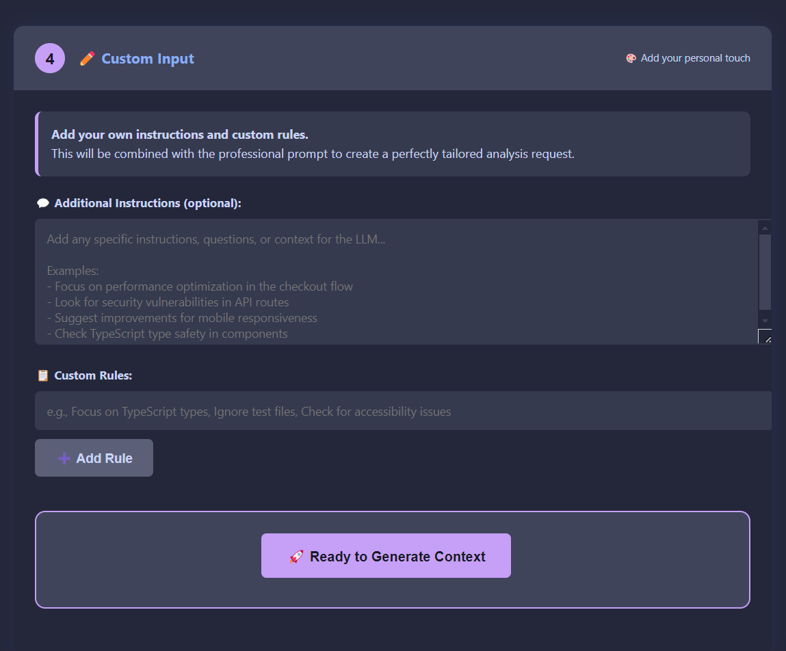

# Next.js LLM Context

A powerful VS Code extension that generates comprehensive context files from your Next.js codebase for optimal use with Large Language Models (LLMs) like ChatGPT, Claude, and others.

**🎯 Now with Professional Step-by-Step UI and 12 Expert Prompt Templates!**


*Initial file selection interface with step-by-step guidance and empty selection state*

## 🚀 Features

### 🎨 **Modern Step-by-Step UI**
- **Interactive Step Wizard** - guided 5-step process for perfect context generation
- **Activity Bar Integration** - dedicated panel in VS Code sidebar
- **File Selection Tree** - visual file picker with checkboxes
- **Real-time Progress** - see your progress through each step
- **Professional Templates** - 12 expert-crafted prompt templates

### 🎯 **Professional Prompt Templates**
Choose from 12 specialized templates for different use cases:

#### **Development & Implementation**
- 🐛 **Bug Fix Analysis** - Debug issues and identify problems
- 🚀 **Feature Development** - Plan and implement new features  
- 🔄 **Refactoring Help** - Large-scale code improvements

#### **Analysis & Review**
- 🔍 **Code Review** - Comprehensive code quality analysis
- ⚡ **Performance Optimization** - Speed and efficiency improvements
- 🏗️ **Architecture Analysis** - Deep architectural insights

#### **Documentation & Communication**
- 📚 **Documentation Generation** - Create comprehensive docs
- 👋 **Developer Onboarding** - Help new team members

#### **Specialized Analysis**
- 🔒 **Security Audit** - Security vulnerability assessment
- 🧪 **Testing Strategy** - Testing approach and coverage
- 🔄 **Migration Planning** - Technology migration assistance


*12 expert-crafted prompt templates organized in a clean grid layout for easy selection*

### ✨ **Latest Next.js Support (v15+)**
- **App Router** prioritization with intelligent file categorization
- **Server Components** and **Client Components** detection
- Support for all App Router conventions (`layout`, `page`, `loading`, `error`, `not-found`, `template`, `global-error`)
- **Route Handlers** (`route.ts/js`) detection
- **Middleware** support

### 🎯 **Smart File Prioritization**
Files are intelligently categorized and prioritized for optimal LLM processing:

1. **A: Core Configurations** (Priority 80-100)
   - Next.js config files (`next.config.js/ts/mjs`)
   - Package configuration (`package.json`)
   - TypeScript/JavaScript config
   - Styling configuration (Tailwind, etc.)
   - Middleware

2. **B: App Router Structure** (Priority 60-80)
   - Layouts, pages, loading states
   - Error boundaries and templates
   - API routes in app directory

3. **C: Pages Router Structure** (Priority 68-78)
   - `_app`, `_document`, `_error`
   - API routes in pages directory
   - Custom error pages (404, 500)

4. **D: Components** (Priority 50-55)
   - Client components (`'use client'`)
   - Server components
   - UI components

5. **E: Hooks & Utilities** (Priority 45-48)
   - Custom hooks
   - Utility functions and libraries

6. **F: Data Layer** (Priority 40-42)
   - State management (Redux, Zustand, Context)
   - Database schemas and migrations

7. **G: Styling** (Priority 30-35)
   - Global styles and component styles

8. **H: Other Files** (Priority 10-25)
   - TypeScript/JavaScript files
   - Configuration files
   - Documentation

### 🎨 **Multiple Output Formats**
- **XML Format** - Structured tags for better LLM parsing
- **Markdown Format** - Traditional markdown with code blocks  
- **JSON Format** - Structured data for programmatic use

### 🎯 **Custom User Input**
- **Personal Instructions** - Add your own analysis requirements
- **Custom Rules** - Define specific focus areas
- **Combined Output** - Professional templates + your custom input

### 🛡️ **Enhanced Ignore Patterns**
Comprehensive default ignore patterns for modern Next.js development:

- **Build outputs**: `.next/`, `.swc/`, `out/`, `build/`, `dist/`, `.turbo/`
- **Dependencies**: `node_modules/`
- **Environment**: `.env*` files
- **Lock files**: All package manager lock files (`package-lock.json`, `yarn.lock`, `pnpm-lock.yaml`, `bun.lockb`)
- **Media files**: Images, fonts, audio, video
- **Development tools**: Coverage reports, logs, temporary files
- **AI IDEs**: `.cursor/`, `.windsurf/` configurations

### 📊 **Rich Context Output**
- **Token usage estimation** with LLM-specific limits
- **File statistics** and metadata
- **Progress indicators** during generation
- **Structured output** with categories and priorities

## 🔧 Installation

### Option 1: Install from VSIX File
1. Download the latest `.vsix` file from the releases
2. Open VS Code
3. Press `Ctrl+Shift+P` (or `Cmd+Shift+P` on Mac) to open Command Palette
4. Type `Extensions: Install from VSIX...`
5. Select the downloaded `.vsix` file
6. Restart VS Code if prompted

### Option 2: Manual Installation
1. Clone and build from source:
   ```bash
   git clone https://github.com/hongkongkiwi/nextjs-llm-context
   cd nextjs-llm-context
   pnpm install
   pnpm run build
   pnpm run package
   code --install-extension nextjs-llm-context-*.vsix
   ```

## 📦 Building and Packaging

### Creating VSIX Files
To create a distributable VSIX package:

1. **Install Dependencies**:
   ```bash
   pnpm install
   ```

2. **Build the Extension**:
   ```bash
   pnpm run build
   ```

3. **Create VSIX Package**:
   ```bash
   pnpm run package
   ```
   This creates a `nextjs-llm-context-X.X.X.vsix` file in the root directory.

4. **Alternative Package Commands**:
   ```bash
   # Install and package locally for testing
   pnpm run package:install
   
   # Run full CI pipeline (lint, test, package)
   pnpm run ci
   ```

### Installing VSIX Files

#### Method 1: VS Code GUI
1. Open VS Code
2. Go to Extensions view (`Ctrl+Shift+X`)
3. Click the `...` menu in the Extensions view
4. Select `Install from VSIX...`
5. Choose your `.vsix` file

#### Method 2: Command Line
```bash
code --install-extension nextjs-llm-context-2.1.1.vsix
```

#### Method 3: Command Palette
1. Press `Ctrl+Shift+P` (Windows/Linux) or `Cmd+Shift+P` (Mac)
2. Type `Extensions: Install from VSIX...`
3. Select your `.vsix` file

### Development Setup
For development and testing:

```bash
# Clone the repository
git clone https://github.com/hongkongkiwi/nextjs-llm-context
cd nextjs-llm-context

# Install dependencies
pnpm install

# Build the extension
pnpm run build

# Package for distribution
pnpm run package

# Install locally for testing
pnpm run package:install

# Run linter
pnpm run lint

# Run tests
pnpm run test

# Run full CI pipeline
pnpm run ci
```

## 📖 Usage

### Step-by-Step UI (Recommended)
1. Open your Next.js project in VS Code
2. Click the **Next.js LLM Context** icon in the Activity Bar
3. Follow the 5-step guided process:

#### **Step 1: File Selection**
- Use the **📁 File Selection** panel to choose specific files
- Or leave empty for automatic smart selection
- See real-time file count and selection status


*File selection interface showing 453 selected items with detailed breakdown of directories and individual files*


*Comprehensive view of selected files and directories with expandable lists and item counts*

#### **Step 2: Configuration** 
- Choose output format (XML/Markdown/JSON)
- Select target LLM (Claude/GPT/Gemini/Custom)
- Enable/disable ready-to-use prompts


*Configuration interface with output format selection and target LLM options*


*Dropdown menu showing all available target LLM options including Claude, ChatGPT, Gemini, and Custom*

#### **Step 3: Professional Prompts**
- Browse 12 expert-crafted templates
- Select the one matching your use case
- Or skip for custom-only analysis


*Professional prompts interface with selected Migration Planning template and continue option*

#### **Step 4: Custom Input**
- Add your specific instructions
- Define custom analysis rules
- Combine with professional templates


*Custom input step allowing personal instructions and custom rules for tailored analysis*

#### **Step 5: Generate**
- Generate your optimized context file
- Copy directly to clipboard
- View token usage statistics

### Quick Generation (Command Palette)
- **Next.js LLM Context: Quick Generate** - Fast XML generation with defaults
- **Next.js LLM Context: Generate Context** - Classic step-by-step wizard
- **Next.js LLM Context: Generate with LLM Prompts** - Quick prompt selection

### Custom Ignore Patterns
Create a `.nextjscollectorignore` file in your project root:

```
# Custom ignore patterns
*.test.ts
*.spec.js
/cypress/
/playwright/
custom-folder/
specific-file.ts
```

## 🎯 Perfect for LLM Interactions

### Professional Use Cases
- **🐛 Debugging** - Get expert help finding and fixing bugs
- **🚀 Feature Development** - Plan new features with architectural guidance  
- **📚 Documentation** - Generate comprehensive project documentation
- **🔍 Code Reviews** - Thorough analysis with specific recommendations
- **⚡ Performance** - Identify optimization opportunities
- **🔒 Security** - Vulnerability assessment and fixes
- **🧪 Testing** - Improve test coverage and strategy
- **🔄 Migrations** - Plan technology upgrades and migrations

### Output Examples
Generated files include:
- **Context**: Prioritized file contents with metadata
- **Professional Prompts**: Expert-level analysis requests
- **Token Estimates**: LLM-specific usage calculations
- **Project Structure**: Visual directory tree
- **Instructions**: Ready-to-paste LLM prompts

## 🔄 Recent Updates & Changelog

### v2.1.1 (2024-06-16) - Critical Bug Fixes
- **🔧 Parent-Child Selection Fix** - Fixed child directories not being deselected when parent is deselected
- **📁 Recursive Directory Handling** - Improved recursive selection/deselection of nested directories
- **🔄 Tree View Synchronization** - Better checkbox state management for directory hierarchies
- **📊 Enhanced Logging** - Better debugging for directory selection operations

### v2.1.0 - Previous Updates
- **🔧 Selection Sync Fix** - Fixed UI not updating when all files are deselected
- **✅ Empty State Handling** - Proper "no files selected" display when selection is cleared
- **🔄 Event Propagation** - Improved event handling between Tree View and UI

### Recent Enhancements (Unreleased)
- **🚀 Automated CI/CD Pipeline** - GitHub workflows for building, testing, and publishing
- **📦 Enhanced Package Scripts** - Development workflow improvements with pnpm support
- **🔧 Repository Migration** - Updated from `sriem` to `hongkongkiwi` ownership
- **📝 Publishing Infrastructure** - Automated publishing to VS Code Marketplace and Open VSX Registry
- **⚙️ Smart Environment Detection** - Publishes only when required secrets are configured
- **🛠️ Improved Build Process** - Enhanced ESLint configuration and build reliability

## 🚀 Quick Start for Developers

### Clone and Setup
```bash
git clone https://github.com/hongkongkiwi/nextjs-contextify
cd nextjs-contextify
pnpm install
```

### Development Workflow
```bash
# Start development (watch mode)
pnpm run dev

# Lint code
pnpm run lint

# Build extension
pnpm run build

# Package for testing
pnpm run package

# Install locally for testing
pnpm run package:install

# Run full CI pipeline
pnpm run ci

# Quick CI (no tests)
pnpm run ci:fast
```

### Testing Extension
1. Run `pnpm run package:install`
2. Press `F5` in VS Code to launch Extension Development Host
3. Open a Next.js project in the new window
4. Click the Next.js LLM Context icon in the Activity Bar

### Debugging
- Use VS Code's built-in debugger with the included `launch.json`
- Console logs appear in VS Code's Developer Tools
- Extension logs appear in Output panel → "Extension Host"

## 📁 Project Structure

```
├── src/extension.ts          # Main extension code (2,673 lines - needs refactoring!)
├── .github/workflows/        # CI/CD automation
├── media/                    # Screenshots and images
├── images/                   # Extension icon
└── README.md                # Main documentation
```

## 🛠️ Development

### Prerequisites
- Node.js 22.15.0+ (required)
- pnpm (latest)
- VS Code 1.85.0+

### Setup
```bash
git clone https://github.com/hongkongkiwi/nextjs-contextify
cd nextjs-contextify
pnpm install
```

### Development Commands
```bash
# Build the extension
pnpm run build

# Watch mode for development
pnpm run watch

# Run linter
pnpm run lint

# Fix linting issues
pnpm run lint:fix

# Run tests
pnpm run test

# Package extension
pnpm run package

# Install packaged extension locally
pnpm run package:install

# Run full CI pipeline (lint + test + package)
pnpm run ci

# Run fast CI pipeline (lint + package, skip tests)
pnpm run ci:fast
```

> 🔧 **CI/CD Workflows**: For detailed information about our automated testing, building, and publishing workflows, see [Workflow Documentation](.github/workflows/README.md).

### Release Commands
```bash
# Patch release (2.1.1 → 2.1.2)
pnpm run release

# Minor release (2.1.1 → 2.2.0) 
pnpm run version:minor

# Major release (2.1.1 → 3.0.0)
pnpm run version:major

# Publish to marketplaces (manual)
pnpm run publish:vscode      # VS Code Marketplace only
pnpm run publish:openvsx     # Open VSX Registry only  
pnpm run publish:all         # Both marketplaces

# Release and publish in one command
pnpm run release:publish
```

## 🤝 Contributing

Contributions are welcome! Please feel free to submit a Pull Request.

### Getting Started with Development

#### Prerequisites
- Node.js 22.15.0 or higher
- pnpm (latest version)
- VS Code 1.85.0 or higher

#### Development Setup
```bash
# Clone the repository
git clone https://github.com/hongkongkiwi/nextjs-contextify
cd nextjs-contextify

# Install dependencies
pnpm install

# Start development
pnpm run dev
```

#### Testing Your Changes
```bash
# Build the extension
pnpm run build

# Package for testing
pnpm run package

# Install locally
pnpm run package:install

# Run tests
pnpm run test

# Run linter
pnpm run lint
```

### Development Guidelines

#### Code Style
- Use TypeScript for all new code
- Follow ESLint configuration
- Add JSDoc comments for public APIs
- Use meaningful variable and function names

#### Testing
- Add unit tests for new services
- Add integration tests for UI components
- Ensure all tests pass before submitting PR

#### Commit Messages
Follow conventional commits:
```
feat: add new prompt template for debugging
fix: resolve file selection memory leak
docs: update README with new features
test: add unit tests for FileScanner
```

### Bug Reports

When reporting bugs, include:
- VS Code version
- Extension version
- Node.js version
- Steps to reproduce
- Expected vs actual behavior
- Error messages or logs
- Sample project structure (if relevant)

### Feature Requests

For new features:
- Check existing issues first
- Describe use case and benefits
- Consider implementation complexity
- Provide mockups/examples if applicable

### Priority Areas for Contribution

1. **Code Refactoring**: Help break down the large extension.ts file
2. **Testing**: Add comprehensive test coverage
3. **Performance**: Optimize for large codebases
4. **Documentation**: Improve guides and examples
5. **UI/UX**: Enhance the webview interface

### Pull Request Process

1. Fork the repository
2. Create a feature branch (`git checkout -b feature/amazing-feature`)
3. Make your changes
4. Add tests if applicable
5. Run the full CI pipeline (`pnpm run ci`)
6. Commit changes (`git commit -m 'feat: add amazing feature'`)
7. Push to branch (`git push origin feature/amazing-feature`)
8. Open a Pull Request

#### PR Requirements
- [ ] Code builds successfully
- [ ] Tests pass
- [ ] Linting passes
- [ ] Documentation updated
- [ ] CHANGELOG updated if applicable

### Architecture Goals

When contributing code, keep these principles in mind:
- **Modularity**: Break down large functions/classes
- **Testability**: Write code that can be easily tested
- **Performance**: Consider impact on large codebases
- **User Experience**: Prioritize intuitive, responsive UI
- **Maintainability**: Use clear, self-documenting code

### Recognition

Contributors will be:
- Listed in project acknowledgments
- Mentioned in release notes
- Given appropriate credit in documentation

### Getting Help

- Open an issue for questions
- Join discussions in existing issues
- Contact maintainers for complex contributions

## 📋 Requirements

- VS Code 1.85.0 or higher
- Node.js 22.15.0 or higher
- Next.js project (works with any version, optimized for 13+)

## 🐛 Known Issues

- Very large codebases (10,000+ files) may take longer to process
- Binary files are automatically skipped to prevent corruption

## 📄 License

MIT License - see [LICENSE](LICENSE) file for details.

## 👤 Author

**Andy Savage**
- GitHub: [@hongkongkiwi](https://github.com/hongkongkiwi)
- LinkedIn: [andysavage](https://www.linkedin.com/in/andysavage)

**Andy McCormack**
- GitHub: [@hongkongkiwi](https://github.com/hongkongkiwi)

## 🎯 Professional Prompt Templates Detail

### Development & Implementation
- **🐛 Bug Fix Analysis**: Systematic debugging approach with root cause analysis
- **🚀 Feature Development**: Architectural planning for new features
- **🔄 Refactoring Help**: Strategic code improvement and modernization

### Analysis & Review  
- **🔍 Code Review**: Comprehensive quality assessment with SOLID principles
- **⚡ Performance Optimization**: Core Web Vitals and rendering optimization
- **🏗️ Architecture Analysis**: Scalability and maintainability evaluation

### Documentation & Communication
- **📚 Documentation Generation**: Professional README, API docs, and guides
- **👋 Developer Onboarding**: Team integration and knowledge transfer

### Specialized Analysis
- **🔒 Security Audit**: OWASP Top 10 compliance and vulnerability assessment
- **🧪 Testing Strategy**: Test pyramid approach and quality gates
- **🔄 Migration Planning**: Technology upgrade roadmaps and risk assessment

## 🙏 Acknowledgments

- Next.js team for the amazing framework
- VS Code team for the excellent extension API
- The developer community for feedback and contributions
- AI/LLM providers for inspiring better developer tools

---

**⭐ Star this repo if you find it helpful!**

*Transform your Next.js codebase into AI-ready context with professional prompts and intelligent analysis.*